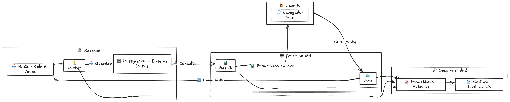

# Estructura del Proyecto
El proyecto en el que se trabajará se basa en el repositorio roxs-devops-project90, un desafío educativo de DevOps creado para aprender contenedorización, orquestación, automatización, y monitoreo. Este repositorio es una versión mejorada del famoso Docker Example Voting App y está adaptado específicamente para el desafío de 90 Días de DevOps.

## Arquitectura del proyecto
Este repositorio incluye una aplicación distribuida compuesta por tres servicios:
* Vote: Un servicio en Flask que permite votar y publica los votos en Redis.
* Worker: Un servicio Node.js que consume los votos desde Redis y los guarda en PostgreSQL.
* Result: Una app en Node.js que muestra los resultados en tiempo real usando WebSockets.

